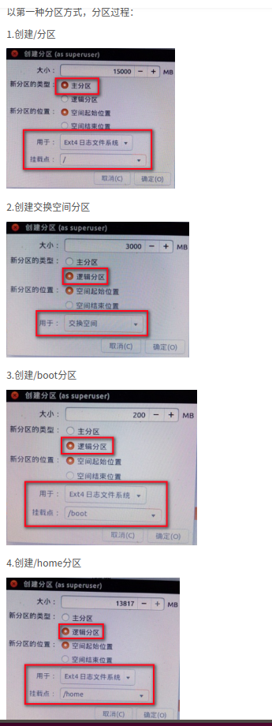
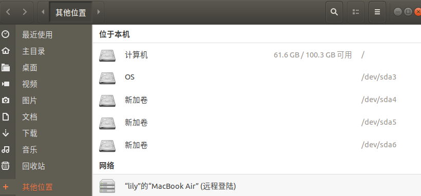
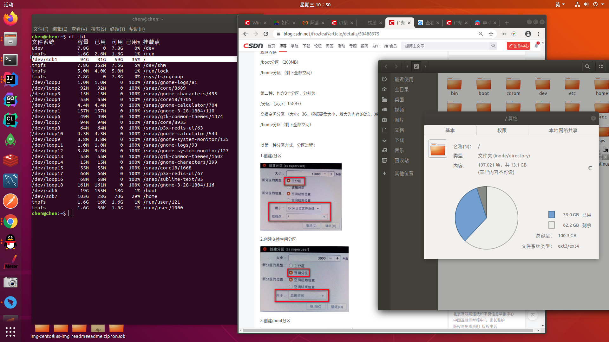
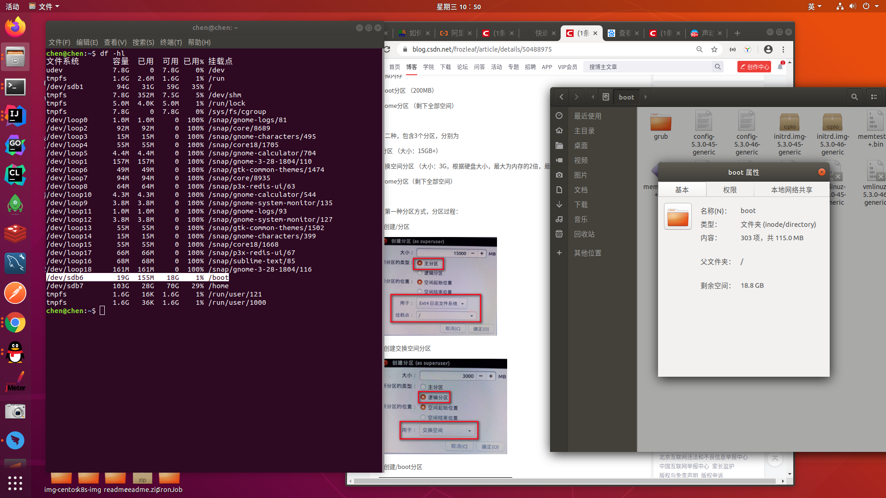
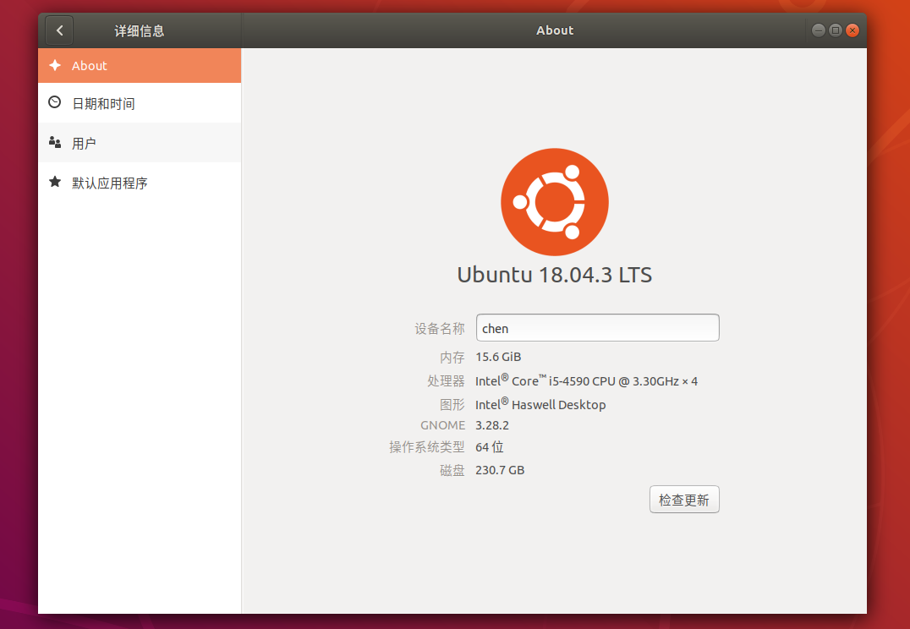

# 装双系统

## 1.镜像制作
    https://blog.csdn.net/tustzhoujian/article/details/53411380
## 2.安装操作
    https://www.cnblogs.com/tanzq/p/9569510.html
## 3.分区
    采用自定义方式，自主分区。注意分区大小
    手动分分区:https://blog.csdn.net/frozleaf/article/details/50488975
    硬盘240G: 100G主分区(类似windows计算机)、20G交换分区、20G boot分区、剩下home分区(100G左右)
    
   
     
    
    
   
## 系统信息
      